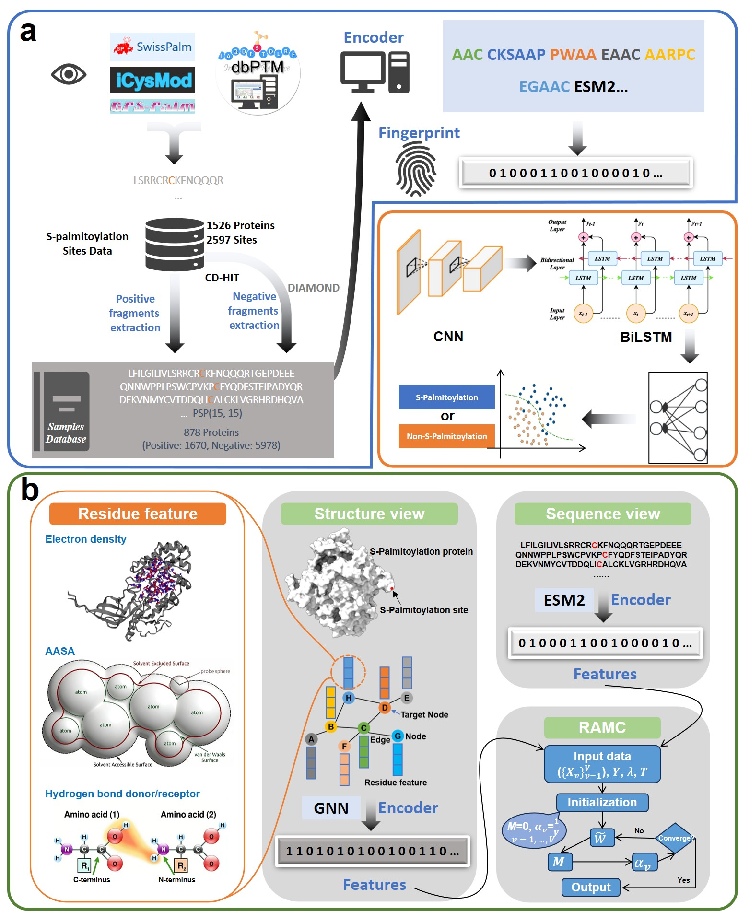

# MVF-Palm

The GNN extracts three-dimensional structural features and integrates the sequence features of ESM2 in a multi-view model.

## Run

baseline:
python --pos_csv ./positive_sample.csv --neg_csv ./negative_sample.csv --seq_col Fragment --mode train --save_dir ./result

seq-structure:
python --pos_csv ./positive_sample.csv --neg_csv ./negative_sample.csv --seq_col Fragment --struct_emb ./stru_embeddings.npy --mode train --save_dir ./result 

seq-RSA:
python --pos_csv ./rsa_po.csv --neg_csv ./rsa_ne.csv --seq_col Fragment --rsa_col rsa --mode train --save_dir ./result

seq-topology:
python --pos_csv ./positive_sample.csv --neg_csv ./negative_sample.csv --seq_col Fragment --mode train --save_dir ./result

seq-Structure-RAMC:
python --pos_csv ./positive_sample.csv --neg_csv ./negative_sample.csv --seq_col Fragment --struct_emb ./stru_embeddings.npy --mode train --save_dir ./result 

seq-GNN_Structure-RAMC:
python --pos_csv ./positive_sample.csv --neg_csv ./negative_sample.csv --pos_gnn_csv ./pos-gnn.csv  --neg_gnn_csv ./neg-gnn.csv --seq_col Fragment --mode train --save_dir ./result

For more parameters, please refer to the code details.

## Demo

a. Sequence-based baseline model framework. b. Multi-view model framework that uses GNN to extract three-dimensional structure features and fuse ESM2 sequence features.
